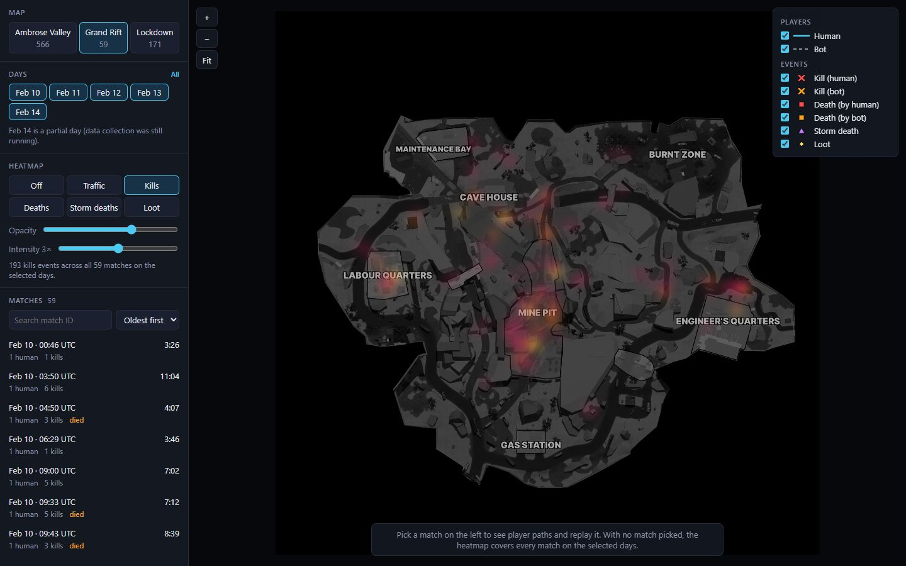
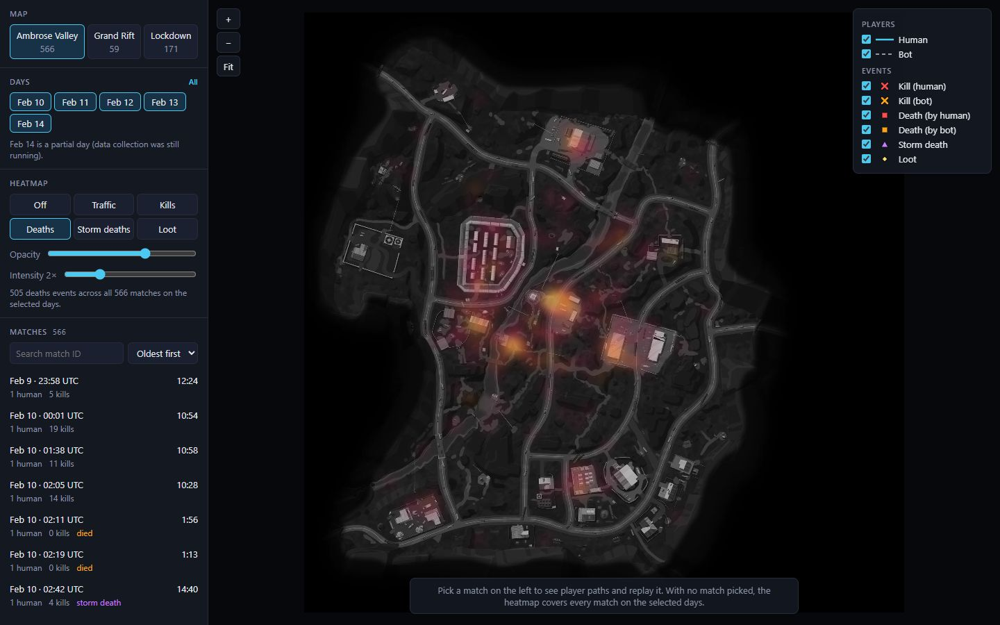

# Insights

Three things I found while using the tool. Each one says what caught my eye, the evidence, what could be done about it, and why a level designer should care.

All numbers come from the 796 matches in the dataset (Feb 10 to 14, 2026). "Deaths" means deaths of human players unless stated otherwise.

---

## 1. Most of this data looks like test matches, not real games

**What caught my eye.** Almost every match in the list says "1 human". Opening them, there is only ever one path on the map. The bots that player fought only show up as kill markers, never as paths of their own.

**Evidence.**

| Files recorded for the match | Matches |
|---|---|
| 1 human, no bot files | 743 (93%) |
| 1 human + 4 to 15 bot files | 36 |
| Bot files only, no human | 16 |
| 2 humans | 1 |

The deaths point the same way. Out of 442 human deaths, 400 (90%) were caused by bots and 39 by the storm. Only **3** were caused by another human. Across all matches, humans killed 2,232 bots and only 3 humans.

A real battle royale with many players would have far more player-vs-player kills. One human playing against bots, again and again, looks a lot like test runs or smoke tests.

**Is it actionable?**
- Check with the data team which sessions were internal tests, and tag them in the telemetry.
- Until then, treat any balance conclusion from this dataset with care. It mostly shows how one player does against bots.
- Metrics affected: share of matches with more than one human, share of deaths caused by humans.

**Why a level designer should care.** If the heatmaps are built from test matches, a fight zone might only be a bot spawn area, not a place real players choose to fight. Map changes based on this data could end up tuned for bots.

---

## 2. Two classic fight zones: Mine Pit (GrandRift) and the river (Ambrose Valley)

**What caught my eye.** On GrandRift, the kills heatmap lights up right on Mine Pit, the red zone in the middle of the map. On Ambrose Valley, the deaths heatmap follows the river that cuts through the centre.

**Evidence: Mine Pit.** It is a small part of the map, but:

| | Share inside Mine Pit |
|---|---|
| Player movement | 17% |
| Loot | 21% |
| Kills | 27% |
| Deaths | 47% (14 of 30) |

It works like Pochinki on PUBG's Erangel: a central spot with good loot that pulls players in, so most of the fighting happens there.

**Evidence: Ambrose Valley river.** Within about 44 m of the river:

| | Share near the river |
|---|---|
| Player movement | 17% |
| Kills | 23% |
| Deaths | 28% |

Players die there more often than you would expect from how much time they spend there. It is like the bridges on Erangel: everyone has to cross, few routes lead over, and that makes them easy places to be caught.

**Is it actionable?**
- Mine Pit: if a high-risk, high-reward centre is the goal, it is working. If not, spread some loot to the quarters or add more cover on the way in.
- River: check cover at the crossings and whether there are enough ways across.
- Metrics affected: share of deaths per zone, deaths near the river compared with time spent there.

**Why a level designer should care.** These are the places that shape how a match plays out. Small changes to cover or loot there will move more fights than changes anywhere else on the map.

---

## 3. Players who die were picking up less loot

**What caught my eye.** Opening matches where the player died, their loot markers were sparse compared with matches where the player survived.

**Evidence.** Loot per minute alive, for players who lasted at least one minute:

| Map | Died | Survived |
|---|---|---|
| Ambrose Valley | 2.1 | 3.0 |
| Lockdown | 1.4 | 2.0 |
| GrandRift | 1.7 | 2.7 |

It is per minute, so it is not just that survivors played longer. On every map, survivors looted 40% to 60% faster. This shows the two go together, not that one causes the other.

**Is it actionable?**
- Look at how much loot sits near spawn points and along the first routes players take.
- Metrics affected: loot picked up in the first two minutes, early death rate.

**Why a level designer should care.** If players who start slow on loot are the ones who die, loot placement near spawns decides who gets a fair start.
